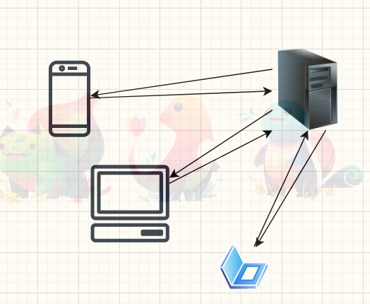
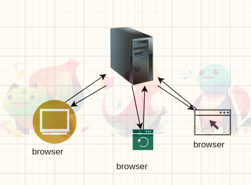
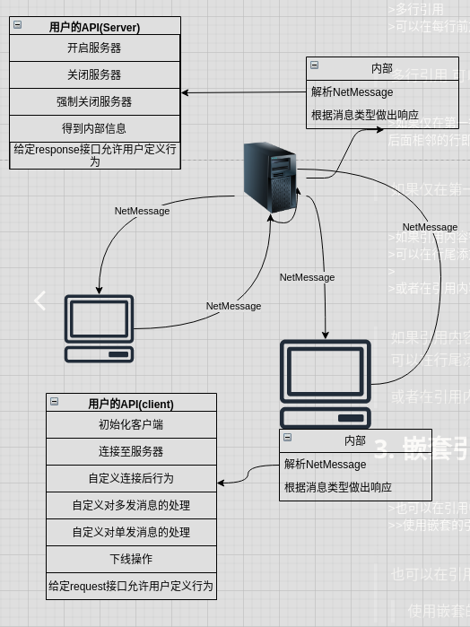

# 万字长篇给女朋友讲懂基于java BIO的CS框架

## 简介
大家好,今天是2022年1月2日,因疫情原因在西安上学的我已经被隔离了快11天了,刚好闲下来开篇博客给和大家聊聊以前学过的一个基于java BIO的CS框架,

1. 首先什么是CS呢
   CS就是Client Server,我们的CS框架指的就是==客户机-服务器模型框架==,与之相似的还有BS(Browser Server浏览器-服务器模型).
   > CS架构   &nbsp; &nbsp; &nbsp; &nbsp; &nbsp; &nbsp; &nbsp; &nbsp;  &nbsp; &nbsp; &nbsp; &nbsp; &nbsp; &nbsp; &nbsp;  BS架构
   
   
2. 这个框架能做什么
   此框架可以协助我们更为方便的开发出CS架构的软件,在现实生活中有很多大型软件都是基于CS架构,像最常见的QQ,微信这些聊天工具,还有王者荣耀,吃鸡这些小游戏都是基于此架构.结束此篇后我还会带着大家,用此框架快速开发一个聊天室软件,
   学过web开发的都知道tomcat服务器,那么基于此框架,再结合一个http服务器,我们就可以做一个简单的tomcat服务器,当然如果我有时间的话,会带大家基于此框架,手写tomcat(大概率是没有时间了).

此项目源码我放在了github上大家可以clone下来分析 https://github.com/nobodyw-cell/Csframework

## 1. 项目分析

### 1.1 功能需求分析

在CS架构的程序设计中这些需求往往是必须的
1. 客户端向服务器发送消息
   1. 消息类型
      1. 请求上线
      2. 请求资源
      3. 请求转发消息
         1. 单发
         2. 群发
2. 客户端接受服务器消息
   1. 消息类型
      1. 上线许可
      2. 资源
      3. 单发消息
      4. 群发消息
3. 服务器向客户端发送消息
   1. 消息类型
      1. 返回资源
      2. 转发消息
         1. 单发
         2. 群发
4. 服务器接受消息
   1. 消息类型
      1. 请求上线
      2. 请求资源
      3. 请求转发消息
         1. 单发
         2. 群发

其形式类似这样

### 1.2 抽象
> 人们所能够解决的问题的复杂性直接取决于抽象的类型与质量 --Thinking in java

掌握解决问题的方法比解决问题更要,以前听一位P8大佬说==学习一个技能的最好方式是为这个技能写一个学习教程==,现在感觉确实十分贴切.
以下是分析这个项目的方法
1. 我们先从面向对象的程序设计出发,对现有问题进行抽象.
   "我们将问题空间中的元素及其在解空间中的表示称为对象"--这个表述十分贴切,我们先将我们问题空间中的元素列出来
   |element|description|
   |---|----|
   |Client|客户端 提供给用户的对象|
   |Server|服务器 提供给用户的对象|
   |ClientConversation| 客户端的会话层 负责处理客户端与服务器之间的会话 对外封闭|
   |ServerConversation| 服务器的会话层 负责处理客户端与服务器之间的会话 对外封闭|
   |Communication|通信层,是个抽象类是两个conversation的共同基类,只负责底层信息的转发与接受,再一步处理交给会话层处理 对外封闭| 
   |NetMessage|对消息的封装 其内置通信四元素 信源 信标 命令 信息本身 对外封闭|
   |ENetCommand|消息命令 对外封闭|
   |IClientAction|是个接口具体实现交由用户实现,相当于我们给用户接口的一个集合|

   
